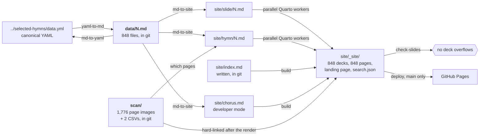
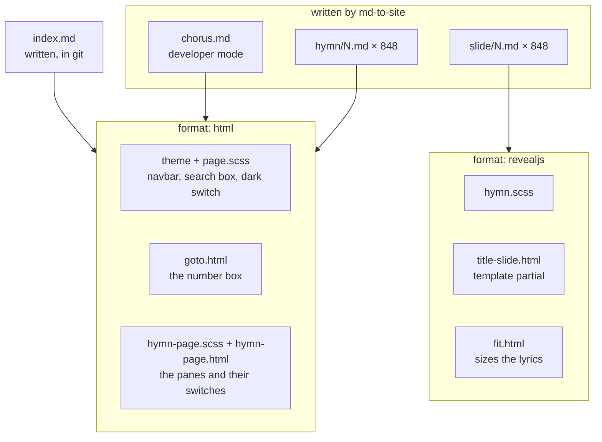
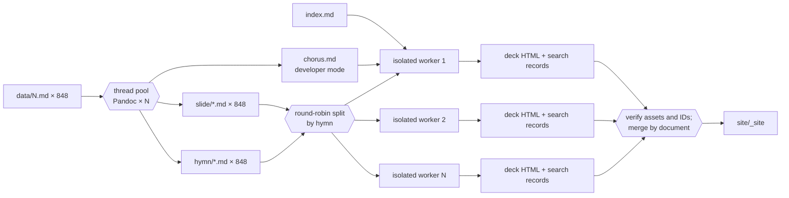

# Developing

Enough to navigate the project. For what the checked-in Markdown means, see
[FORMAT.md](FORMAT.md); for what the site is, see [README.md](README.md). The
files themselves carry the reasoning behind each decision in comments.

## The shape of it

One source, `data/`, and three projections of it: a lossless one back to the
canonical YAML, and two one-way ones — the deck a hymn is sung from and the
page its text is read against the scanned hymnal on.

Beside `data/` sits `scan/`, which is not a projection of anything here. It is
the hymnal itself, copied in from
[`selected-hymns-and-songs-pdf`](https://github.com/ickc/selected-hymns-and-songs-pdf):
one PNG per page of each language edition, and a CSV saying which pages each
hymn is printed on. See [scan/README.md](scan/README.md).



`data/`, `scan/` and `site/index.md` are in git; everything else to the right
is generated, ignored, and rebuilt here and in CI — so it cannot be stale, and
there is no generated file to review in a diff.

## The Python

| module | what it is |
|---|---|
| `model.py` | the validated `Hymn` and the **lossless** codec: YAML ↔ `data/N.md`. Runs Pandoc with the vendored Lua filters. |
| `slides.py` | the **one-way** projection: `Hymn` → slide Markdown, plus the chorus report. |
| `pages.py` | the other **one-way** projection: `Hymn` + `scan/` → page Markdown. |
| `scans.py` | the segmentation CSVs, and linking the page images into the built site. |
| `converter.py` | the CLI, and the directory-level streaming each direction. |

The projections are separate from the codec on purpose. The codec must
round-trip and so may drop nothing; the one-way projections resolve, divide and
discard, and nothing reads them back.

They are separate from each other because a deck and a page are read
differently, and only for that reason. Both come from one parse of one
`data/N.md`, so neither can carry a word the other does not:

| | `slides.py` | `pages.py` |
|---|---|---|
| a stanza over four lines | divided, to fit a screen | whole, as the hymnal prints it |
| the chorus | repeated after every stanza it is sung with | once, where it is written |
| the meter | dropped; nobody reads it off a screen | kept; it is printed in the hymnal |
| a `^[…]` instruction | lifted out of the lyric line | lifted out of the lyric line |

The page keeps the hymnal's shape because it is read *against* the hymnal: one
printed copy of a chorus wants one copy beside it. Where the chorus changes
partway through, the seventeen hymns whose resolution is a rule rather than a
reading say which stanzas take it, in a line under the heading.

Both say what is there, never how it looks: a `lyrics` Div, one paragraph per
lyric line, one language span per translation. Layout is the theme's business,
which is how the same lines render interleaved, or as two aligned columns — the
deck with `?grid` on the URL, the page whenever its pane is wide enough for
them.

### Why `chorus.md` is generated and `index.md` is not

`chorus.md` *is* the resolution — which chorus each stanza of each hymn takes
— so in developer mode it is written by `md-to-site` with the slides it
describes and cannot disagree with them. Writing it by hand would be
transcribing the code's output. Production mode removes it and does not publish
`chorus.html`.

`index.md` is a form and a heading. Its two buttons are the two things a hymn
number opens; Enter submits the first, the deck, because that is the one wanted
in a hurry when a number has just been called out. The one thing on it that
belongs to the collection is the range the number box accepts, and the collection is a printed
book of 848 hymns: `hymns: 848` in `_quarto.yml`, `max=""` in
the page, and `goto.html` reads the range off the field. A constant kept where
the site is configured, named once.

## The site

`site/` is a Quarto project. `site/slide/*.md` and `site/hymn/*.md` are written
by `md-to-site`; nothing in `site/` edits them. What the rest of `site/` is:



`_quarto.yml` declares both formats, and **every document names the one it
wants in its own front matter.** A Quarto project declaring more than one
format renders every document to all of them otherwise, so each deck would
also be built as a plain page over the top of itself.

### Why a hymn is two documents rather than one in two formats

Quarto can give one document several formats, and a hymn wanting both
`revealjs` and `html` looks exactly like that. It is not:

- **The outputs collide.** Both are HTML, so both claim `slide/N.html`, and the
  render dies moving the second over the first.
- **Search cannot tell them apart.** `search: false` is a property of a
  document, not of one of its formats. The index here is one entry per *slide*
  so that a half-remembered line opens the deck at the stanza that sings it;
  a second rendering of the same words under a second URL is not a second
  match, and there would be no way to keep it out.

So `md-to-site` writes two documents from one parse instead. What that costs is
a second file per hymn, ignored by git like the first. What it buys is
`slide/N.html` and `hymn/N.html` — two names for two things, rather than one
name and a suffix — and each with its own front matter to say what it is.

| file | kind | used by |
|---|---|---|
| `_quarto.yml` | project and format configuration | everything |
| `page.scss` | Bootstrap theme layer | the landing page and developer report |
| `goto.html` | `include-after-body` script | the two pages; drives the number box |
| `hymn-page.scss` | Bootstrap theme layer | the hymn pages; the three panes |
| `hymn-page.html` | `include-after-body` script | the hymn pages; builds the toolbar |
| `hymn.scss` | reveal.js theme | every deck |
| `title-slide.html` | Pandoc **template partial** — replaces reveal's title slide | every deck |
| `fit.html` | `include-after-body` script | every deck; sizes the lyrics |

Only `title-slide.html` is a template. The three `.html` scripts are fragments
appended to the body, each inert on a page that does not carry the markup it
looks for.

`_quarto.yml` also names `source-repo`, which is where `data/N.md` is
browsable. `converter.py` reads it from there rather than repeating a
repository URL that has already been renamed once.

The project is a `website` rather than a `default` project for three things:
848 decks share one copy of reveal.js in `site_libs` instead of a 5 MB copy
each; every deck is indexed into `search.json`; and the theme carries the
navbar the search box sits in. The generated `chorus` report is a developer
diagnostic: it is rendered locally, but deliberately absent from the navbar and
search index.

### Search

None of this is ours. A `website` project indexes everything it renders into
`search.json`, and the theme puts a search box over that index in the navbar of
every page — so the feature costs a `search:` block and the decision to have a
theme at all.

What matters is the shape of the index: **one entry per slide**, not per hymn.
A half-remembered line therefore finds the hymn *and* opens at the stanza that
sings it, and the results group by hymn with the other matching stanzas behind
"more matches in this document".

Two documents opt out with `search: false`. The chorus report is developer-only
rather than part of the site's discovery surface. Every `hymn/N.md` opts out
because it holds the same words as the deck beside it: indexing it would double
every result without adding a match, and half of them would open a page for
reading rather than the deck at the stanza. The way to a hymn page is the
landing page, or the link on the deck's own page — not the search box.

This is why the html format has a theme rather than `theme: none`: without one
there is no navbar to put the box in, and Quarto finds nothing it recognizes as
content on the two pages, so neither would be in the index.

### Parallel rendering

Quarto can render one file or a directory, so the decks can be divided into
subsets. A website render also writes project-wide output, though: in
particular, rendering one hymn replaces `search.json` with an index containing
only that hymn. Concurrent renderers in `site/` would also race while moving
the same `index.html` and `site_libs` into `_site`.

`scripts/build_site.py` gives each Quarto process a temporary, isolated copy of
the project containing only its subset of the generated Markdown. A hymn's deck
and its page go to the same worker: they are two renders of one hymn, and a
worker's share is then one contiguous idea rather than two partitions that
could disagree. After all workers succeed, it combines the disjoint output,
verifies shared assets are identical, and merges their per-slide search
entries. Worker 1 also builds the landing page and developer-only chorus
report. Nothing partial replaces `site/_site` until every worker and the merge
have succeeded.

`scan/` is not in the copies. It is 45 MB of PNG, and inside the project each
of sixteen workers would be handed all of it to render fifty hymns against,
while every render and preview reload walked 1,776 images looking for input.
Nothing about them needs Quarto — they are published exactly as they are
checked in — so `scans.stage` hard-links them into `site/_site/scan` after the
render instead, which is one filesystem operation each and no copying at all.
`pixi run build` does this itself; `build-serial` runs `scripts/stage_scans.py`
after `quarto render`, which knows nothing about `scan/`.

The copies contain only project configuration/assets plus each worker's
disjoint share of the 8 MB of projected Markdown. They do not duplicate an existing
site. On the 16-core benchmark, preparing all copies took 0.1 seconds and
merging their output took 0.1 seconds; the work between those log lines is
Quarto. Symlinking this small input would add path-resolution coupling without
materially changing build time.



Search is not rebuilt from plain text by this script. Each worker asks Quarto
to index the rendered HTML for its own documents, producing the same complete
records Quarto would produce for those documents in a full render. The merge
checks their IDs are disjoint, groups the records in deterministic document
order, and preserves Quarto's slide order inside each hymn. Comparing with a
native serial render gives the same 6,611 IDs and record contents and the same
files everywhere else. `search.json` itself is not byte-identical because
Quarto's full render emits its top-level records in a different order; that
array order is not part of the search behavior.

The source projection is parallel too. Each hymn parse invokes an external
Pandoc process, so a `ThreadPoolExecutor` keeps all physical cores busy without
adding a second layer of Python worker processes. On 16 physical cores, the
complete projection measured 19.60 seconds serially, 2.58 seconds with threads,
and 2.23 seconds with processes. At the four-core CI scale, threads measured
5.58 seconds and processes 5.38 seconds; the small difference does not justify
the process startup, pickling and cross-platform complexity. `executor.map`
also preserves numeric hymn order, and a test checks serial and parallel
projection output byte-for-byte.

### Build modes

`HYMN_BUILD_MODE` is either `develop` (the local default) or `production`.
Production is the published shape: `md-to-site` removes the generated chorus
report, so neither parallel nor serial rendering can emit `chorus.html`.
Developer mode generates and renders the report, though it remains absent from
navigation and search.

The build uses physical rather than SMT threads on hardware (respecting Linux
CPU affinity). Under a hypervisor it uses every vCPU allocated to the guest,
because its reported physical topology describes the host implementation
rather than additional capacity available to the runner. It prints the
detected and selected counts and uses that capacity by default. Set it
explicitly when CPU or memory calls for a different balance:

```sh
pixi run build -- -j 4
```

`pixi run build-serial` retains the old one-process build for comparison.

`pixi run serve` first performs the parallel build, then starts `quarto
preview --render none`. Quarto serves that existing output immediately and
watches the project; after startup, it renders only the input page that
changed. A change under `data/` still needs a restart because Quarto watches
the projected `site/` rather than its source.

### Fitting

A fixed font size trades between two failures: lyrics that overflow the slide,
and short stanzas that leave the screen empty. `fit.html` measures every slide
against reveal's fixed logical viewport (1280×720, declared in `_quarto.yml`
and therefore a contract, not a preference) and sets the whole hymn to the
smallest type that fits any of its slides — one size per hymn, so the type does
not jump between stanzas.

It records that size on the document as `data-fit-size`, which is what makes
848 decks checkable without looking at them.

## Checking

Nobody is going to open 848 decks, so two scripts do it instead.

- `scripts/check_slides.py` (`pixi run check-slides`) loads every rendered deck
  in the headless browser Quarto installs, fails on one whose lyrics overflow
  or whose fitting never ran, and reports the decks whose type ended up small
  enough to want a second look at how the stanza was divided.
- `scripts/chorus_report.py` (`pixi run chorus-report`) prints the hymns whose
  chorus the projection had to work out. `--expect 17` fails if that list
  changes, so a new one cannot arrive unseen.

`pixi run test` is the unit suite: `tests/test_conversion.py` covers the
lossless codec, `tests/test_slides.py` the slide projection, `tests/test_pages.py`
the page projection — including the ways it deliberately differs from the deck —
`tests/test_scans.py` the segmentation CSVs and the staging of their images, and
`tests/test_build_site.py` the partitioning and merge.

The hymn pages have no equivalent of `check-slides`. A deck can fail invisibly,
by overflowing a fixed viewport 848 times over; a page scrolls, so there is no
such failure to hunt for.

## Tasks

```
yaml-to-md     Render the canonical YAML collection as data/N.md
md-to-yaml     Rebuild the canonical YAML from data/N.md
md-to-site     Project data/N.md as the slide and page Markdown, and the report
build          Regenerate the projections and render every deck and page in parallel
build-serial   Regenerate the projections and render in one Quarto process
serve          Preview the site on $QUARTO_PORT (8020)
check-slides   Measure every rendered deck in a browser; fail on overflow
chorus-report  List the hymns whose chorus the projection resolves
test           Run the conversion and projection tests
setup-chrome   Install the headless browser check-slides needs
clean          Remove everything the projection and the render generate
```

`yaml-to-md` and `md-to-yaml` are the only tasks that need the canonical
collection checked out beside this repository at `../selected-hymns`. Nothing
needs `../selected-hymns-and-songs-pdf`: what the site uses of it is copied into
`scan/` and carried in git.

## Getting set up

Everything is pinned in `pixi.lock`; there is nothing else to install.

```sh
pixi install            # Pandoc, Quarto, Python and the package itself
pixi run test
pixi run serve          # projects the slides and previews the site
pixi run setup-chrome   # ~260 MB, and only check-slides needs it
pixi run check-slides
```

## CI

`.github/workflows/ci.yml` defaults `HYMN_BUILD_MODE` to `production`, so the
normal path runs the suite, renders all 848 decks and pages, and uploads
`site/_site`
without generating the chorus report or installing a browser. A manual
workflow dispatch can select `develop` to additionally guard the chorus list
with `--expect 17` and measure every rendered deck in the browser. This keeps
the expensive checks available without putting them on every push.

The deploy job publishes only production builds of `main`. Branches build but
never touch the live site.

Actions are pinned to commit SHAs; a tag can be moved to point at new code.
