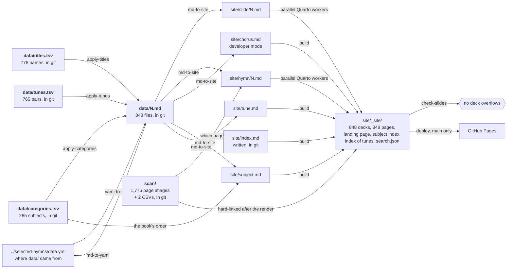
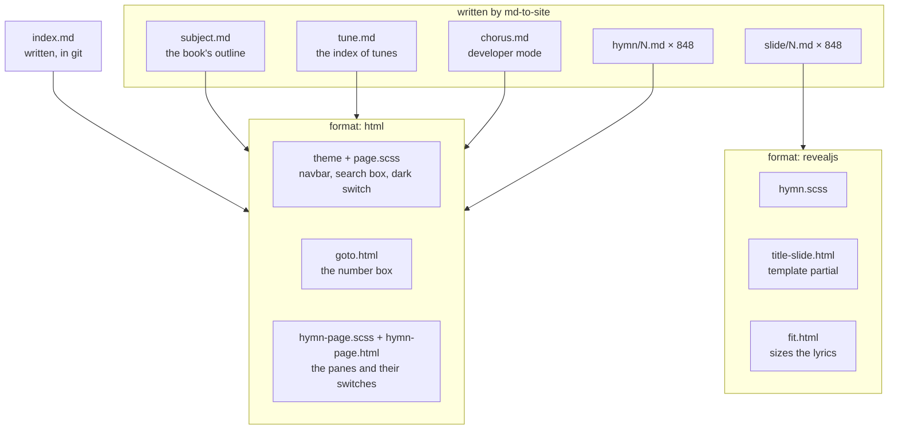
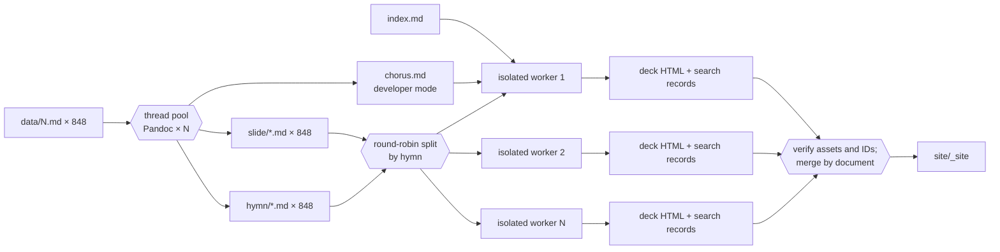

# Developing

Enough to navigate the project. For what the checked-in Markdown means, see
[FORMAT.md](FORMAT.md); for what the site is, see [README.md](README.md). The
files themselves carry the reasoning behind each decision in comments. For what
the data is still missing and what could be built from the book's front and
back matter, see [PLAN.md](PLAN.md) — proposals, none of them built yet.

## The shape of it

One source, `data/`, and three projections of it: a lossless one back to the
YAML shape it was bootstrapped from, and two one-way ones — the deck a hymn is
sung from and the page its text is read against the scanned hymnal on. `data/`
is the source of record; see [the split from
`selected-hymns`](#the-split-from-selected-hymns).

Beside `data/` sits `scan/`, which is not a projection of anything here. It is
the hymnal itself, copied in from
[`selected-hymns-and-songs-pdf`](https://github.com/ickc/selected-hymns-and-songs-pdf):
one PNG per page of each language edition, and a CSV saying which pages each
hymn is printed on. See [scan/README.md](scan/README.md).



`data/`, `scan/` and `site/index.md` are in git; everything else to the right
is generated, ignored, and rebuilt here and in CI — so it cannot be stale, and
there is no generated file to review in a diff.

`data/categories.tsv`, `data/titles.tsv` and `data/tunes.tsv` are the three
things that write *into* `data/`. All three are preprocessing, run when they
change rather than on the way to the site, and all three were read out of the
book's own front or back matter, which is the only place any of them exists.
See [the category table](#the-category-table), [the title
table](#the-title-table) and [the tune table](#the-tune-table). The category
table is read a second time on the way *out*, as the subject index: a hymn
knows its own subject, but only the table knows what order the subjects come
in. The tune table is not — once applied, a hymn knows its own tune, and the
[index of tunes](#the-index-of-tunes) is projected from the hymns.

## The Python

| module | what it is |
|---|---|
| `model.py` | the validated `Hymn` and the **lossless** codec: YAML ↔ `data/N.md`. Runs Pandoc with the vendored Lua filters. |
| `slides.py` | the **one-way** projection: `Hymn` → slide Markdown, plus the chorus report. |
| `pages.py` | the other **one-way** projection: `Hymn` + `scan/` → page Markdown. |
| `scans.py` | the segmentation CSVs, and linking the page images into the built site. |
| `categories.py` | `data/categories.tsv`: the book's subject outline, and the **preprocessing** step that writes the English half of each hymn's category from it. |
| `titles.py` | `data/titles.tsv`: the name the book's subject index files each hymn under, and the **preprocessing** step that writes it. |
| `tunes.py` | `data/tunes.tsv`: the tune the English edition sets each hymn to, and the **preprocessing** step that writes it. |
| `tuneindex.py` | The **projection** of the whole collection as the book's alphabetical index of tunes. |
| `subjects.py` | the third **one-way** projection, and the only one about the collection: the table + every `Hymn` → the subject index page. |
| `meters.py` | the **check** with no output of its own: what the meter over a hymn says its Chinese lines should scan as, against what they do. |
| `converter.py` | the CLI, and the directory-level streaming each direction. |

The projections are separate from the codec on purpose. The codec must
round-trip and so may drop nothing; the one-way projections resolve, divide and
discard, and nothing reads them back.

They are separate from each other because a deck and a page are read
differently, and only for that reason. Both come from one parse of one
`data/N.md`, so neither can carry a word the other does not:

| | `slides.py` | `pages.py` |
|---|---|---|
| a stanza over four lines | divided, to fit a screen | whole, as the hymnal prints it |
| the chorus | repeated after every stanza it is sung with | once, where it is written |
| the meter | dropped; nobody reads it off a screen | kept; it is printed in the hymnal |
| a `^[…]` instruction | lifted out of the lyric line | lifted out of the lyric line |

The page keeps the hymnal's shape because it is read *against* the hymnal: one
printed copy of a chorus wants one copy beside it. Where the chorus changes
partway through, the seventeen hymns whose resolution is a rule rather than a
reading say which stanzas take it, in a line under the heading.

Both say what is there, never how it looks: a `lyrics` Div, one paragraph per
lyric line, one language span per translation. Layout is the theme's business,
which is how the same lines render interleaved, or as two aligned columns — the
deck with `?grid` on the URL, the page whenever its pane is wide enough for
them.

### Why the meter names its languages and nothing else does

Localized metadata is written into the front matter as one scalar, the English
half then the Chinese, and cut apart again on the way back in by writing
system: `category: The Word of God—Loving the Word神的話——愛慕神的話` is one
line, and the boundary is where Latin stops and Han starts. That works for
every field whose Chinese half is Han.

A meter is mostly figures, and a figure belongs to no writing system, so there
are two ways the cut goes wrong. `8.8.8.8.D. (A)` beside `8.8.8.8.D.` — the
English edition marks the anapestic setting and the Chinese page does not — is
Latin and digits throughout, with no boundary to cut at: run together, the pair
would come back as one string. And `Irregular Meter` beside `10.10.10.8.5. 和`
has a boundary, in the wrong place: the figures go to the Latin run on their
left, and what comes back is `Irregular Meter10.10.10.8.5.` and `和`.

So a localized meter is written as a mapping instead, and nothing about it is
inferred from its characters:

```yaml
meter:
  en: 10.10.10.8.5. with chorus
  zh: 10.10.10.8.5. 和
```

A meter both editions print alike stays a scalar — `meter: 8.7.8.7.D.` — which
is 466 of the 848. The other 382 name their two halves.

### Why `chorus.md` is generated and `index.md` is not

`chorus.md` *is* the resolution — which chorus each stanza of each hymn takes
— so in developer mode it is written by `md-to-site` with the slides it
describes and cannot disagree with them. Writing it by hand would be
transcribing the code's output. Production mode removes it and does not publish
`chorus.html`.

`index.md` is a form and a heading. Its two buttons are the two things a hymn
number opens; Enter submits the first, the deck, because that is the one wanted
in a hurry when a number has just been called out. The one thing on it that
belongs to the collection is the range the number box accepts, and the collection is a printed
book of 848 hymns: `hymns: 848` in `_quarto.yml`, `max=""` in
the page, and `goto.html` reads the range off the field. A constant kept where
the site is configured, named once.

## The split from `selected-hymns`

`data/` was bootstrapped from
[`selected-hymns`](https://github.com/ickc/selected-hymns)`/data.yml`, and for
a while the two said the same thing. They no longer do, and are not meant to.
This repository is where the hymnal is now maintained: `data/N.md` is the
source of record, and `data.yml` is the shape it started in.

What has been added here and is not there:

- **the English half of every category**, from
  [the category table](#the-category-table);
- **hymn 570's meter**, `8.6.8.6. with chorus` / `8.6.8.6. 和`, which the publisher's English
  source had dropped along with the whole header line — leaving a placeholder
  an editor had typed in its place sitting in the `title` field, the only
  `title` in the collection and not a title at all. The hymnal prints no hymn
  titles;
- **corrections read off `scan/`**: hymn 108's subject (祂的得勝, not
  祂的救贖), 832 and 833 (預備, as 654–656 have), 838 (我們的深切需要, as 690
  has), the removal of `（參720）` from 840's, which is not printed on its page,
  and a missing syllable in 845 (從未曾拒絕人來信, eight as its 8.8.8.5. meter
  wants);
- **138 hymns given the meter the hymnal prints and `data/` had lost.** The
  first 93 were `Irregular Meter` / `特` — 36 of them `特.和`, which is what the
  Chinese page writes when the chorus is sung to the same tune. The last 45 were
  read one at a time off the page that prints them, which for 31 of them is the
  Chinese page and nothing else. `data.yml` has no meter at all on any of the
  138, and every hymn in the collection now carries one;
- **twelve meters corrected against the book's own metrical index**, which
  files every hymn 1–764 under a meter and so is a second printing of the same
  fact. Where it disagreed with `data/`, the Chinese page was read as the third
  witness, and on eleven of the twelve it sided with the index: `data/`'s meters
  came from an old OCR of the English page. Hymn 384 had hymn **385**'s meter,
  taken from the top of the next page. Hymn 6, the Doxology, is the one place
  the *book* is wrong — its English page prints `8. 6. 8. 6. with chorus` over
  four lines of eight with no chorus. See [D13](PLAN.md);
- **hymn 772's `8.8.8.8.8.`**, which its page prints as `8.8.8.8.7.`, and
  **hymn 777's `.8.6.8.6.6.6.7.5.`**, whose leading dot was a typo and whose
  page marks a chorus `data/` had not;
- **eighteen meters the English edition declines to count.** It files 111 hymns
  under `Irregular Meter`; on eighteen of them the Chinese page prints figures,
  and those figures are now what both halves carry. Fifteen of the eighteen
  scan exactly as they say. `data.yml` has `Irregular Meter` on none of the 111
  and no meter at all on most of them;
- **eight more lines a syllable short**, found by counting rather than by
  reading: 412 (但願我能像馬利亞), 430 (祂的豐盛我能倚), 441 (背起十架跟耶穌),
  479 (將我恢復), 486 (主，我接受你作一切), 503 (我也禱告並立志), 704
  (要我遠離罪俗) and 729 (沒有神，沒指望, which had a 有 too many). Each was
  the one verse of its hymn that would not scan; see `meter-report` under
  [Checking](#checking);
- **hymns 797 and 798, which were each other**. Not just their subjects: the
  Chinese page 855 prints 求你揀選我道路 under 797 and page 857 prints
  我無能力 under 798, and `data/` had both hymns entire under the other's
  number;
- **the English of 797, 824 and 845**, which `data/` did not have at all
  although the English edition prints all three — and says so itself, in the
  list of Chinese-only hymns on its own last page, which names 39 hymns and not
  these. `data/` was missing English for a different 39, which is why the two
  sets looked like each other for so long. See [PLAN.md](PLAN.md);
- **a re-lineation, in 824**. The English page breaks its single stanza into
  seven six-syllable lines; the Chinese page sets the text continuously under
  the staff, and `data/` had it as the four lines of its 12.12.12.6. meter.
  The Chinese is now broken at its own commas into the same seven, character
  for character unchanged, so that the two languages pair line by line as they
  do in every other bilingual stanza in the collection;
- **twelve of hymn 480's twenty-four Chinese lines**, which were not the text
  its page prints. Every one of them scans, so no syllable count could have
  found them: 故祂這榮耀主人，取代了我 for the page's 故祂這榮耀的人，安家我心，
  and 哦主，哦主，借著你的經營 for 哦主，哦主，藉著你的運行. What found them
  was the chorus check — 480 is the one hymn whose choruses do not scan alike,
  and reading the page to see whether the odd syllable was ours or the book's
  showed the whole hymn had drifted. The odd syllable *is* the book's: the page
  prints fifteen in the first chorus's second line and fourteen in the other
  two, so 480 is still reported, and now for the right reason. The wording is
  the page's; the orthography stays the collection's, which writes 你 and 著
  everywhere and 祢 and 着 nowhere;
- **hymn 365's first line**, which had `Love Divine, all love excelling` where
  its page prints `all loves ex-cel-ling`. The subject index names the hymn
  *Love Divine, all loves excelling*, and the disagreement between that name
  and the lyric is what found it;
- **hymn 583's subject**, which `data/` gave as `因著信靠祂` where its own page
  (`zh/621`) prints `因著信靠主`, as the other twelve hymns under that subject
  do. The subject index lists 583 in the run under 因着信靠主 and prints no
  such second subject, so the table had carried two rows that flattened to one
  English heading;
- **one normalisation that departs from `scan/`**: hymn 822's subject is
  `因著祂足夠的恩典` here, though its page prints `足彀`. The other four hymns
  under that subject print `足夠`, and a reader searching for one spelling
  should not be shown four of the five. The rule that the page wins still
  holds everywhere else, `彀` included: the Chinese-only appendix uses it in
  the lyrics of 814 and 817, where the body of the book would write `夠`, and
  those are left as printed.

`md-to-yaml` still works and is still lossless — that is a property of the
projection, not a claim that the two repositories agree. **`yaml-to-md` is the
task to be careful with**: run against the upstream file it would overwrite all
of the above. Point it at a scratch directory if what you want is a comparison.

## The category table

The hymnal prints a subject over every hymn, and the two editions print
different amounts of it. The Chinese page carries the whole path —
`安慰與鼓勵－因着主的照顧` — while the English page carries only its first
level, `Comfort and Encouragement`. The publisher's Chinese source, which
`data/` descends from, therefore gave every hymn a Chinese category and no
English one at all.

The rest of the English path is in the book, in the subject index of the
English edition (pages v–xvi). That index is numbered exactly as the Chinese
one (pages 七–十一) is, three levels deep — `I. PRAISE AND WORSHIP`,
`2. THE FATHER`, `(1) His Greatness` against `一．讚美和敬拜`, `2. 聖父`,
`(1) 祂的偉大` — and each entry lists the hymns filed under it. Matching the
two by those hymn numbers pairs 248 of the Chinese categories with one
English heading and no ambiguity at all; the rest are named in
`data/categories.tsv` itself.

```
n1  n2  n3  zh1        zh2  zh3      en1                en2         en3
1   2   1   讚美和敬拜  聖父  祂的偉大  Praise and Worship  The Father  His Greatness
```

285 rows, one per subject, in the order the book prints them. Tab-separated
because the names contain commas, quotation marks and parentheses and cannot
contain a tab: a hand-edited row needs no quoting and cannot be misread. The
English is title-cased, as the table of contents prints it, rather than the
capitals of the index.

The table stores the levels **apart** and joins them — Chinese with an em dash
pair and the third parenthesised, English with one em dash and the third in
round brackets — which is what the two editions print over a hymn and what
`data/N.md` carries. Splitting that back into levels would mean parsing a
format we control, and the parse would have to survive `The Son, His Person and
Work` and `Psalm 126:1-3`; joining cannot go wrong.

`n1 n2 n3` is the numbering the book prints (`I.` / `2.` / `(1)`), and it is
the **only** record of the order. Sorting the subjects by their lowest hymn
number does not recover it: under the Father the book runs Greatness, Glory,
Majesty, Mercy, Love, and by first hymn number that comes out Greatness, Glory,
Love, Redemption, Majesty. So the numbering is checked as it is read — every
level has to run 1, 2, 3… under its parent, a heading has to keep one number
throughout, and a level 2 is either one subject or a run of them. A row
inserted without renumbering fails rather than being filed in the wrong place.

The order was read back off the Chinese subject index (`zh/003`–`zh/007`,
主題目錄), whose OCR gives the headings in print order. The names were not
taken from that reading — we already had them — only the sequence, and three
things check it: all 285 subjects matched, exactly once, with nothing left
over; the 222 rows whose printed number the OCR read legibly all agree with the
position they were given; and 703 of the 848 hymns appear in the OCR of the
index line of the very subject they are filed under, the rest lost to wrapped
lines and broken ranges rather than to disagreement.

`pixi run apply-categories` writes the English half into every `data/N.md` and
leaves the Chinese half alone — `data/N.md` is the authority on what the
Chinese page says, and the table only ever supplies the English. It is
idempotent, so it can be run at any time, and it fails rather than write if a
category is missing from the table or a row of the table matches no hymn.
`pixi run check-categories` reports the same without writing.

This is deliberately *not* a step of the site build. `data/N.md` stays the
source everything is built from; the table is how one field of it was derived
once, and how a correction to that field is made again.

The table is read a second time on the way *out*, by `subjects.py`, as
`site/subject.md` — see [the subject index](#the-subject-index).

## The title table

**The hymnal prints no title over a hymn.** A page carries the subject as a
running head, the meter, the number, the credits and the music — look at
`scan/en/21.png`, which is hymn 8, and there is nothing else on it. The book's
own back-matter index is headed *Index of First Lines and Choruses*, and says
under that heading: "first lines are in lower case type; choruses in small
caps". That is the book stating its convention — a hymn is known by the line it
opens with, and by the chorus it is sung to.

The one place it names each hymn once is the **subject index**: 764 entries in
the main index (`en/004`–`en/015`) and 45 more in the supplement's own
(`en/920`–`en/922`), all set in one lower-case face with nothing to mark which
are names and which are opening lines. Counted against the line each hymn
opens with:

| | |
|---|---|
| the same line | 373 — 49% |
| the index cuts that line short to fit its column | 148 — 19% |
| **another name altogether** | **243 — 32%** |

That third is the tune (`Abba` 19, `Higher ground` 395, `Spirit song` 181 —
all three appear verbatim in the Alphabetical Index of Tunes), the chorus
(`Up from the grave He arose` 101), or simply what the hymn is called
(`How great Thou art` 8, `Leaning on the Everlasting Arms` 338).

```
number  en
8       How great Thou art
```

778 rows: 764 − 31 scripture portions, plus 45 from the supplement. **The
scripture portions, 734–764, have no name** — the index gives them a verse
reference (`103:1`), and the reference is already in the category. And the
table is **English**: the 主題目錄 lists bare numbers and the 首句索引 lists
eight-character first lines, so no Chinese index names a hymn at all.

**How the text was got, and why it is not OCR.** The index was read for *which
line* each hymn is named by; the words come from `data/`, already proofread.
Of the 778 named hymns, 720 match a span of their own hymn's English text
closely enough to take that span verbatim — and because the span is matched
against the printed extent, the book's truncations survive (`Behold, what love`
stays short of `what boundless love`). The other 58 name something not in the
lyrics, or the OCR mangled a word; each of those was read off the rendered page
by eye. Where the index and the hymn page disagree on a word — `O God and
Father` against the page's `O God our Father` — the page wins, as it does
everywhere else here. Read the other way, that disagreement is a way of finding
dropped words: hymn 365 was indexed *Love Divine, all loves excelling* and had
*all love excelling* in `data/`, and its page (`scan/en/397.png`) prints
`loves`.

`pixi run apply-titles` writes the name into every `data/N.md`, and removes it
from a hymn the table no longer names, so deleting a row is as complete as
adding one. `pixi run check-titles` reports the same without writing.

`slides.title()` fills the title in **per language**: the book's English name
where there is one, the first line where there is not, and the Chinese first
line always. So hymn 8's deck, page and index entry all read *How great Thou
art* beside *當我思念，我主，你創造大工*.

**What this cost.** It also confirmed [D6](PLAN.md) from a second direction:
the supplement's subject index lists 45 of the 48 supplement hymns our `data/`
gives English text to, and the three it omits are 779, 789 and 840 — exactly
the three the book's own *Hymns Available In Chinese But Not In English* page
names, and exactly the three PLAN.md says carry English the book does not
print.

## The tune table

**The hymnal does not print the tune over the hymn either.** Look at
`scan/en/159.png`, which is hymn 146: the subject, the meter `8. 6. 8. 6.`, the
number, and — because this one hymn is printed to two settings — the words
*First tune*. It does not name either tune. The names are in the back matter,
and they are there **twice**:

- *Alphabetical Index of Tunes*, `en/895`–`en/898`: tune, then the hymns set to
  it.
- *Metrical Index of Tunes*, `en/899`–`en/904`: meter, then tune, then the same
  hymns.

```
hymn    tune
146     Azmon
146     Lyngham
```

765 rows: one per (hymn, tune) pair, covering hymns 1–764 — the English
edition's own extent, with the supplement and the 39 Chinese-only hymns having
no tune because neither index reaches them. 625 distinct tunes. One hymn, 146,
carries two, in the order the indexes number them, `Azmon (1)` and
`Lyngham (2)`, which is the *First tune* and *Second tune* its page prints; the
field is a name or an ordered list of names, and never localized, because the
Chinese edition names no tune at all.

**Two printings of one relation is what makes the table trustworthy.** Each
index was parsed on its own — three narrow columns per page, so the column has
to be decided line by line from the bounding boxes, and rows clustered on the
vertical centre rather than the top — and the two were then required to agree
exactly, hymn for hymn and letter for letter:

| | |
|---|---|
| both indexes give the same name | 632 hymns |
| the two scans disagree; the printed page settles it | 132 hymns |
| **left unresolved** | **none** |

Every one of those 132 turned out to be the *scan* misreading a name the two
indexes in fact print alike — `Ononville` for `Ortonville`, `Hennas` for
`Hermas`, a nought for the `O` of `O Perfect Love`, a full stop for the comma
of `Courage, Brother`. Not one was a real disagreement between the two printed
indexes. What comes out is a relation covering exactly hymns 1 to 764 with no
hymn missing and none past the end — a shape neither index states and neither
could have been rigged to produce.

`pixi run apply-tunes` writes the tune into every `data/N.md` and removes it
from a hymn the table no longer names; `pixi run check-tunes` reports the same
without writing. The tune is then shown on the hymn page beside the meter,
which is where a hymnal reader looks for it: the two together are what say
whether one text can be sung to another's music. It is not on a slide, for the
same reason the meter is not.

**What this paid for.** The metrical index also files each hymn under a meter,
so it is a second opinion on the meter `data/N.md` already carries. 733 of the
764 agreed; the other 31 were read off both editions' pages and settled, and
759 now agree. That is [D13](PLAN.md), and it closed D1 as well: every hymn in
the collection carries a meter.

## The subject index

`site/subject.md` is the third projection of `data/`, and the only one that is
about the collection rather than about one hymn: the outline the hymnal is
arranged by, eighteen sections deep in places, with every hymn a number under
the subject it is filed in. It needs both sources and neither alone — a hymn
knows its own subject but not where that subject comes in the book, and the
table knows the order but not which hymns are under it.

It is generated by `md-to-site` beside the decks and the pages, ignored by git
like them, and reachable from the navbar. Every heading carries its numbering
as its identifier (`#subject-1-2-1`), because two subjects under one heading are
named the same often enough — the Father's Love and the Son's — that an
identifier made of the words would collide.

Each hymn is its number and what it is called, set in columns as the book's
index is: the book's own name for it, from [the title
table](#the-title-table), and its opening line where the book names it not at
all. The name is English and the Chinese beside it is always the first line,
because no Chinese index names a hymn.

Two ways it is honestly less than the book, and the page says both:

- The hymnal **orders** the hymns under a subject by that name; this orders
  them by number, which is what the collection can be ordered by without
  reading the index again.
- The hymnal **cross-lists** a few hymns under a second subject — 13 is under
  both *His Love* and *His Sonship* — and a single-valued `category` cannot
  hold that. Each hymn appears once, under the subject its own page prints.

## The index of tunes

`site/tune.md` is the fourth projection, and the second about the collection
rather than about one hymn: every tune the English edition names, and the hymns
set to it. Unlike the subject index it needs no table on the way out — once
`apply-tunes` has run, each hymn carries its own tune, and the page is the
collection inverted.

**The order is the hymnal's, and it is not plain alphabetical.** The book files
a name word by word, so `A Friend` precedes `Abba` and `Alford` precedes `All
for Jesus`; it expands a leading `St.` to the word it stands for, so `St.
Thomas` sits between `Sagina` and `Sandon`; and it lets a comma or an
apostrophe sort before a letter, so `Behold What Manner of Love` precedes
`Behold, What Love` and `I Will Guide Thee` precedes `I'd Rather Have Jesus`.
Sorting the 625 names by that rule reproduces the book's printed sequence
exactly but for two entries, where the book's own index disagrees with itself
(`Come, Let us Anew` is filed as though the comma were not there, and `Let the
Beauty of Jesus Seen in Me` is simply out of order).

**The metrical index is not generated**, though it is the same relation grouped
the other way and the book prints both. It would have to be filed by the meter
in `data/N.md`, and 30 of the 764 hymns do not yet agree with the book about
what that is — see [D13](PLAN.md). It is worth doing after D1 and D7, not
before.

## The site

`site/` is a Quarto project. `site/slide/*.md` and `site/hymn/*.md` are written
by `md-to-site`; nothing in `site/` edits them. What the rest of `site/` is:



`_quarto.yml` declares both formats, and **every document names the one it
wants in its own front matter.** A Quarto project declaring more than one
format renders every document to all of them otherwise, so each deck would
also be built as a plain page over the top of itself.

### Why a hymn is two documents rather than one in two formats

Quarto can give one document several formats, and a hymn wanting both
`revealjs` and `html` looks exactly like that. It works, and two things that
sound like blockers are not:

- Both outputs are HTML and would both claim `slide/N.html`, but `output-file`
  under the second format renames it and the render succeeds.
- `search: false` **nested under `format: html:`** does keep that output out of
  `search.json` while the deck stays in it.

The reasons are the two that remain.

**A single source pins both outputs to one directory.** `output-file` rejects
anything with a path separator — *"Invalid value for `output-file`: paths are
not allowed"* — so the page can only be `slide/N-page.html`, beside the deck it
is not. Two documents give `slide/N.html` and `hymn/N.html`: a directory per
product, which is what the landing page's two buttons and `goto.html` already
map onto.

**The two do not differ by visibility.** `content-visible` hides a block that
both documents contain. These differ in how the same stanzas are *divided* —
one halves a long stanza and repeats the chorus after each stanza that sings
it, the other keeps the hymnal's shape and wraps it in three panes. One source
would have to carry both divisions in full and hide one, roughly doubling every
generated file and leaving Markdown that has to be de-multiplexed to read. It
would also have to say `unless-format="revealjs"` rather than
`when-format="html"` every time, because reveal.js *is* an HTML format and
`when-format="html"` matches it too — a leak that shows up as page-only content
appearing on a deck, 848 times over, with nothing failing.

So `md-to-site` writes two documents from one parse instead. The cost is a
second generated file per hymn, ignored by git like the first, and a check in
`build_site.py` that both projections describe the same hymns. The gain is that
each document's front matter says plainly what it is.

| file | kind | used by |
|---|---|---|
| `_quarto.yml` | project and format configuration | everything |
| `page.scss` | Bootstrap theme layer | the landing page and developer report |
| `goto.html` | `include-after-body` script | the two pages; drives the number box |
| `hymn-page.scss` | Bootstrap theme layer | the hymn pages; the three panes |
| `hymn-page.html` | `include-after-body` script | the hymn pages; builds the toolbar |
| `hymn.scss` | reveal.js theme | every deck |
| `title-slide.html` | Pandoc **template partial** — replaces reveal's title slide | every deck |
| `fit.html` | `include-after-body` script | every deck; sizes the lyrics |

Only `title-slide.html` is a template. The three `.html` scripts are fragments
appended to the body, each inert on a page that does not carry the markup it
looks for.

`_quarto.yml` also names `source-repo`, which is where `data/N.md` is
browsable. `converter.py` reads it from there rather than repeating a
repository URL that has already been renamed once.

The project is a `website` rather than a `default` project for three things:
848 decks share one copy of reveal.js in `site_libs` instead of a 5 MB copy
each; every deck is indexed into `search.json`; and the theme carries the
navbar the search box sits in. The generated `chorus` report is a developer
diagnostic: it is rendered locally, but deliberately absent from the navbar and
search index.

### Search

None of this is ours. A `website` project indexes everything it renders into
`search.json`, and the theme puts a search box over that index in the navbar of
every page — so the feature costs a `search:` block and the decision to have a
theme at all.

What matters is the shape of the index: **one entry per slide**, not per hymn.
A half-remembered line therefore finds the hymn *and* opens at the stanza that
sings it, and the results group by hymn with the other matching stanzas behind
"more matches in this document".

The subject index is in the index too, one entry per section, so a subject can
be searched for by name in either language.

Two documents opt out with `search: false`. The chorus report is developer-only
rather than part of the site's discovery surface. Every `hymn/N.md` opts out
because it holds the same words as the deck beside it: indexing it would double
every result without adding a match, and half of them would open a page for
reading rather than the deck at the stanza. The way to a hymn page is the
landing page, or the link on the deck's own page — not the search box.

This is why the html format has a theme rather than `theme: none`: without one
there is no navbar to put the box in, and Quarto finds nothing it recognizes as
content on the two pages, so neither would be in the index.

### Parallel rendering

Quarto can render one file or a directory, so the decks can be divided into
subsets. A website render also writes project-wide output, though: in
particular, rendering one hymn replaces `search.json` with an index containing
only that hymn. Concurrent renderers in `site/` would also race while moving
the same `index.html` and `site_libs` into `_site`.

`scripts/build_site.py` gives each Quarto process a temporary, isolated copy of
the project containing only its subset of the generated Markdown. A hymn's deck
and its page go to the same worker: they are two renders of one hymn, and a
worker's share is then one contiguous idea rather than two partitions that
could disagree. After all workers succeed, it combines the disjoint output,
verifies shared assets are identical, and merges their per-slide search
entries. Worker 1 also builds the landing page and developer-only chorus
report. Nothing partial replaces `site/_site` until every worker and the merge
have succeeded.

`scan/` is not in the copies. It is 45 MB of PNG, and inside the project each
of sixteen workers would be handed all of it to render fifty hymns against,
while every render and preview reload walked 1,776 images looking for input.
Nothing about them needs Quarto — they are published exactly as they are
checked in — so `scans.stage` hard-links them into `site/_site/scan` after the
render instead, which is one filesystem operation each and no copying at all.
`pixi run build` does this itself; `build-serial` runs `scripts/stage_scans.py`
after `quarto render`, which knows nothing about `scan/`.

The copies contain only project configuration/assets plus each worker's
disjoint share of the 8 MB of projected Markdown. They do not duplicate an existing
site. On the 16-core benchmark, preparing all copies took 0.1 seconds and
merging their output took 0.1 seconds; the work between those log lines is
Quarto. Symlinking this small input would add path-resolution coupling without
materially changing build time.



Search is not rebuilt from plain text by this script. Each worker asks Quarto
to index the rendered HTML for its own documents, producing the same complete
records Quarto would produce for those documents in a full render. The merge
checks their IDs are disjoint, groups the records in deterministic document
order, and preserves Quarto's slide order inside each hymn. Comparing with a
native serial render gives the same 6,611 IDs and record contents and the same
files everywhere else. `search.json` itself is not byte-identical because
Quarto's full render emits its top-level records in a different order; that
array order is not part of the search behavior.

The source projection is parallel too. Each hymn parse invokes an external
Pandoc process, so a `ThreadPoolExecutor` keeps all physical cores busy without
adding a second layer of Python worker processes. On 16 physical cores, the
complete projection measured 19.60 seconds serially, 2.58 seconds with threads,
and 2.23 seconds with processes. At the four-core CI scale, threads measured
5.58 seconds and processes 5.38 seconds; the small difference does not justify
the process startup, pickling and cross-platform complexity. `executor.map`
also preserves numeric hymn order, and a test checks serial and parallel
projection output byte-for-byte.

### Build modes

`HYMN_BUILD_MODE` is either `develop` (the local default) or `production`.
Production is the published shape: `md-to-site` removes the generated chorus
report, so neither parallel nor serial rendering can emit `chorus.html`.
Developer mode generates and renders the report, though it remains absent from
navigation and search.

The build uses physical rather than SMT threads on hardware (respecting Linux
CPU affinity). Under a hypervisor it uses every vCPU allocated to the guest,
because its reported physical topology describes the host implementation
rather than additional capacity available to the runner. It prints the
detected and selected counts and uses that capacity by default. Set it
explicitly when CPU or memory calls for a different balance:

```sh
pixi run build -- -j 4
```

`pixi run build-serial` retains the old one-process build for comparison.

`pixi run serve` first performs the parallel build, then starts `quarto
preview --render none`. Quarto serves that existing output immediately and
watches the project; after startup, it renders only the input page that
changed. A change under `data/` still needs a restart because Quarto watches
the projected `site/` rather than its source.

### Fitting

A fixed font size trades between two failures: lyrics that overflow the slide,
and short stanzas that leave the screen empty. `fit.html` measures every slide
against reveal's fixed logical viewport (1280×720, declared in `_quarto.yml`
and therefore a contract, not a preference) and sets the whole hymn to the
smallest type that fits any of its slides — one size per hymn, so the type does
not jump between stanzas.

It records that size on the document as `data-fit-size`, which is what makes
848 decks checkable without looking at them.

## Checking

Nobody is going to open 848 decks, so two scripts do it instead.

- `scripts/check_slides.py` (`pixi run check-slides`) loads every rendered deck
  in the headless browser Quarto installs, fails on one whose lyrics overflow
  or whose fitting never ran, and reports the decks whose type ended up small
  enough to want a second look at how the stanza was divided.
- `scripts/apply_categories.py --check` (`pixi run check-categories`) fails if
  any hymn's category has drifted from `data/categories.tsv`, so an edit to one
  without the other cannot be committed unnoticed. Reading the table at all
  checks its numbering, so a subject inserted without renumbering fails here
  and in every build.
- `scripts/apply_titles.py --check` (`pixi run check-titles`) does the same for
  `data/titles.tsv`, and also fails if a row names a hymn that is not there.
- `scripts/apply_tunes.py --check` (`pixi run check-tunes`) does the same for
  `data/tunes.tsv`.
- `scripts/chorus_report.py` (`pixi run chorus-report`) prints the hymns whose
  chorus the projection had to work out. `--expect 17` fails if that list
  changes, so a new one cannot arrive unseen.
- `scripts/check_meters.py` (`pixi run meter-report`) counts the syllables of
  every Chinese lyric line against the meter printed over the hymn. A meter is
  a syllable count and Chinese is one syllable to the character, so this is not
  a heuristic: where the two disagree, either a character has gone missing from
  the text or the meter was mistyped, and the report's classification says
  which shape the disagreement has. It is still a report and not a gate --
  `--strict` makes it one -- because 139 hymns disagree. On 89 of the 108 that
  are hymns 1--764, the metrical index confirms the meter independently, so the
  disagreement is a finding about the lyrics; see [PLAN.md](PLAN.md).

  Two counts have no meter to check against and are checked anyway. Where the
  hymnal prints `Irregular Meter` it names no lengths, but the verses can still
  be counted against each other, which is the only check the 93 irregular hymns
  can have -- 11 of them fail it. And a hymn that writes a chorus out under
  every stanza sings all of them to one strain, so their lines have to agree
  even where the words do not; nothing else in the collection would catch a
  syllable lost from a chorus. `--shape` prints the counts themselves, hymn by
  hymn and stanza by stanza. None of them is written into `data/N.md`: the
  meter there is what the book prints, and a derived one beside it would be a
  second thing to keep true.

`pixi run test` is the unit suite: `tests/test_conversion.py` covers the
lossless codec, `tests/test_slides.py` the slide projection, `tests/test_pages.py`
the page projection — including the ways it deliberately differs from the deck —
`tests/test_scans.py` the segmentation CSVs and the staging of their images,
`tests/test_categories.py` the subject table and the step that applies it,
`tests/test_subjects.py` the subject index built from it,
`tests/test_titles.py` the title table and the step that applies it,
`tests/test_meters.py` the syllable check, and `tests/test_build_site.py` the
partitioning and merge.

The hymn pages have no equivalent of `check-slides`. A deck can fail invisibly,
by overflowing a fixed viewport 848 times over; a page scrolls, so there is no
such failure to hunt for.

## Tasks

```
yaml-to-md        DESTRUCTIVE: overwrite data/N.md with the upstream YAML
md-to-yaml        Rebuild the canonical YAML from data/N.md
md-to-site        Project data/N.md as the slides, the pages, the two indexes and the report
apply-categories  Rewrite each hymn's category from data/categories.tsv
check-categories  Fail if any hymn's category disagrees with that table
apply-titles      Rewrite each hymn's title from data/titles.tsv
check-titles      Fail if any hymn's title disagrees with that table
apply-tunes       Rewrite each hymn's tune from data/tunes.tsv
check-tunes       Fail if any hymn's tune disagrees with that table
build             Regenerate the projections and render every deck and page in parallel
build-serial      Regenerate the projections and render in one Quarto process
serve             Preview the site on $QUARTO_PORT (8020)
check-slides      Measure every rendered deck in a browser; fail on overflow
chorus-report     List the hymns whose chorus the projection resolves
meter-report      List the hymns whose Chinese lyrics do not scan as their meter
test              Run the conversion and projection tests
setup-chrome      Install the headless browser check-slides needs
clean             Remove everything the projection and the render generate
```

`yaml-to-md` and `md-to-yaml` are the only tasks that need `../selected-hymns`
checked out beside this repository. **`yaml-to-md` overwrites all 848 files
with what upstream says**, which undoes everything `data/` has gained since it
was bootstrapped from there — see [the
split](#the-split-from-selected-hymns). Point it at a scratch directory if what
you want is a comparison; `md-to-yaml` is the direction to use. Nothing
needs `../selected-hymns-and-songs-pdf`: what the site uses of it is copied into
`scan/` and carried in git, and `data/categories.tsv`, `data/titles.tsv` and
`data/tunes.tsv` are the reading of its front and back matter, already made.

## Getting set up

Everything is pinned in `pixi.lock`; there is nothing else to install.

```sh
pixi install            # Pandoc, Quarto, Python and the package itself
pixi run test
pixi run serve          # projects the slides and previews the site
pixi run setup-chrome   # ~260 MB, and only check-slides needs it
pixi run check-slides
```

## CI

`.github/workflows/ci.yml` defaults `HYMN_BUILD_MODE` to `production`, so the
normal path runs the suite, renders all 848 decks and pages, and uploads
`site/_site`
without generating the chorus report or installing a browser. A manual
workflow dispatch can select `develop` to additionally guard the chorus list
with `--expect 17` and measure every rendered deck in the browser. This keeps
the expensive checks available without putting them on every push.

The deploy job publishes only production builds of `main`. Branches build but
never touch the live site.

Actions are pinned to commit SHAs; a tag can be moved to point at new code.
